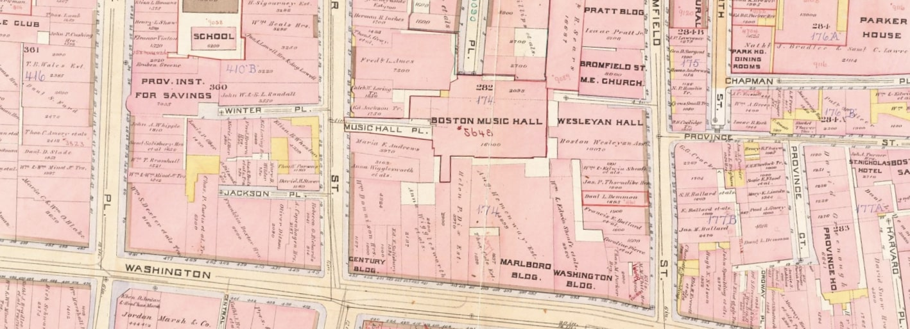

Derek R. Strykowski, *University at Buffalo*



THE CITY OF BOSTON, MASSACHUSETTS, has played an essential role in the development of North American musical life since at least 1698, when a new edition of the Bay Psalm Book included the first music to be printed and published anywhere on the continent. By the late nineteenth century, Boston was home to such internationally renowned composers as George Whitefield Chadwick, Amy Beach, and Edward MacDowell. The period 1865–1915, from roughly the end of the Civil War through the onset of World War I, witnessed the city’s musical support industries flourishing in equal measure.

This ongoing digital mapping project, a byproduct of my research into the life and work of music publisher Arthur P. Schmidt and the composers of the so-called Second New England School, visualizes the manifold musical products and services on offer in the *Boston Directory* between 1865 and 1915. The maps can help us to answer a historical question so basic that it is easily overlooked: “Who was there?” 

The project thus offers a bird’s-eye view of the city’s music making that is nevertheless finely detailed in the information that it presents to scholars. It joins those of digital historians like [Louis K. Epstein](https://musicalgeography.org/) and [Lincoln Mullen](https://lincolnmullen.com) in offering new, flexible means of visualizing the spaces of our musical past.

#### Making the Maps

The annual *Boston Directory* identifies the addresses of businesses that provided everything the nineteenth-century musician could desire: from music stands to music publishers. (These particular listings are found, in the directory of 1885, between those for the manufacturers of mucilage and mustard.) The directory’s publisher in 1865 was Adams, Sampson, & Co. of Boston, although the name of the firm was changed to Sampson, Davenport, & Co. in 1866, then to Sampson, Murdock, & Co. in 1885, and finally to Sampson & Murdock in 1904.

The abbreviated names of musicians remain as printed, so as to preserve the names by which they may have been known professionally. However, street abbreviations (such as “Wash.” for “Washington”) have been silently expanded within the data. The initial bulk geocoding was performed using a free service called [Geocodio](https://www.geocod.io/upload/) and was then checked for historical accuracy against period atlases on [Mapjunction](https://www.mapjunction.com). Street addresses from 1865, for example, were checked against the *Atlas of the County of Suffolk, Massachusetts* (Philadelphia, G. M. Hopkins, 1874). Those from 1875 were checked against the *Atlas of the City of Boston* (Philadelphia: Bromley, 1883). Special care was taken to account for the phased renumbering of Washington Street, one of the city’s main commercial thoroughfares, when dealing with atlases and directory information from the 1870s. The maps themselves are generated with an R package called [Leaflet](https://rstudio.github.io/leaflet/), and finally presented here on the web in [Shiny Markdown](https://shiny.rstudio.com/articles/rmarkdown.html). The base map uses a customized [Jawg](https://www.jawg.io) theme called “Boston Bromley,” inspired by the street atlases of yesteryear, which I designed myself for the project.

Select a year and a category of musical activity (e.g. music teachers) from the menu below to see it on the map. **Note: Data from 1885–1915 remains incomplete as of the present release.**


```{r, echo = FALSE, message = FALSE}

library(tidyverse)
library(dplyr)
library(shiny)
library(leaflet)
library(DT)

boston_directory <- read.csv(file = "BostonDirectory.csv")

sliderInput("chosen_year", 
            label = "Select a year:",
            min = 1865,
            max = 1915,
            value = 1875,
            step = 10,
            sep = "")

output$YearName <- renderText(input$chosen_year)

renderUI({
year_directory <- subset(boston_directory,
                         Year == input$chosen_year,
                         select = c(1:10))

year_categories <- unique(year_directory$Category,
                          incomparables = FALSE) %>% sort

# Below, "selected" is recursive, to preserve existing value:
selectInput("chosen_category", 
            label = "Select a category:", 
            choices = year_categories, 
            selected = input$chosen_category, 
            multiple = FALSE, 
            selectize = FALSE)
})

output$CategoryName <- renderText(input$chosen_category)

checkboxInput("chosen_map", "View satellite imagery", value = FALSE, width = NULL)

output$MapChoice <- renderText(input$chosen_map)
```

### Boston’s `r textOutput("CategoryName", inline = TRUE)`  in `r textOutput("YearName", inline = TRUE)`

```{r, echo = FALSE, message = FALSE}
output$boston_map <- renderLeaflet({
chosen_addresses <- subset(boston_directory, 
                 Category == input$chosen_category & Year == input$chosen_year,
                 select = c(1:10))

chosen_addresses$Address <- c(paste("<b>", as.character(chosen_addresses$Name), "</b></br>", as.character(chosen_addresses$Street), "</b></br>", as.character(chosen_addresses$Notes)))

if (input$chosen_map == TRUE){
   basemap <- "https://server.arcgisonline.com/ArcGIS/rest/services/World_Imagery/MapServer/tile/{z}/{y}/{x}"
} else {
   basemap <- "https://tile.jawg.io/e9d0c5ad-3e2d-4c1d-ad84-e30e3043ebe0/{z}/{x}/{y}{r}.png?access-token=Ep5Z3SkaOZ5c87hhekh1r2l6lkWGRh1OckLArxpesT3sxqVMmibg0bTH02JaXsQn"
}

if (input$chosen_map == TRUE){
   baseattr <- "Tiles &copy; Esri &mdash; Source: Esri, i-cubed, USDA, USGS, AEX, GeoEye, Getmapping, Aerogrid, IGN, IGP, UPR-EGP, and the GIS User Community"
} else {
   baseattr <- "Tiles <a href=\"https://www.jawg.io\" target=\"_blank\">&copy; Jawg</a> - <a href=\"https://www.openstreetmap.org\" target=\"_blank\">&copy; OpenStreetMap</a>&nbsp;contributors"
}

if (is.null(input$directory_table_row_last_clicked)){leaflet(chosen_addresses
    ) %>%
    addTiles(map, 
             urlTemplate = basemap, 
             attribution = baseattr, 
             options = tileOptions(noWrap = TRUE)
    ) %>%
   addMarkers(~Longitude, ~Latitude, popup = ~Address, 
                 clusterOptions = markerClusterOptions(maxClusterRadius = 0)
    )} else 
      {leaflet(chosen_addresses
    ) %>%
    addTiles(map, 
             urlTemplate = basemap, 
             attribution = baseattr, 
             options = tileOptions(noWrap = TRUE)
    ) %>%
   addMarkers(~Longitude, ~Latitude, popup = ~Address, 
                 clusterOptions = markerClusterOptions(maxClusterRadius = 0)
    ) %>%
    addPopups(~Longitude, 
              ~Latitude, 
              popup = ~Address, 
              data = chosen_addresses[input$directory_table_row_last_clicked, ]
   )}
})

leafletOutput("boston_map", width = "100%", height = "800px")

output$CategoryName2 <- renderText(input$chosen_category)
output$YearName2 <- renderText(input$chosen_year)

```

&nbsp;  

### Directory of Boston’s `r textOutput("CategoryName2", inline = TRUE)` in `r textOutput("YearName2", inline = TRUE)`

```{r, echo = FALSE, message = FALSE}
output$directory_table <- renderDT(subset(boston_directory, 
                       Category == input$chosen_category & 
                         Year == input$chosen_year, 
                       select = c(4:7, 10)), 
                filter = "top", 
                rownames = FALSE, 
                selection = "single")

dataTableOutput("directory_table")

output$CategoryName3 <- renderText(input$chosen_category)
output$YearName3 <- renderText(input$chosen_year)
output$CategoryName4 <- renderText(input$chosen_category)
output$YearName4 <- renderText(input$chosen_year)
```

&nbsp;

#### How to Cite These Visualizations
Strykowski, Derek R. “Boston’s `r textOutput("CategoryName3", inline = TRUE)`  in `r textOutput("YearName3", inline = TRUE)`.” Interactive map. *Musical Geographies of Boston, 1865–1915.* 2020. https://dstrykowski.shinyapps.io/boston/

Strykowski, Derek R. “Directory of Boston’s `r textOutput("CategoryName4", inline = TRUE)` in `r textOutput("YearName4", inline = TRUE)`.” Interactive table. *Musical Geographies of Boston, 1865–1915.* 2020. https://dstrykowski.shinyapps.io/boston/

<hr>

©2020 [Derek R. Strykowski](https://dstrykowski.com). This work is licensed under a [Creative Commons Attribution-NonCommercial 4.0 International License](http://creativecommons.org/licenses/by-nc/4.0/). The code is available on [GitHub](https://github.com/dstrykowski/boston). Image credit: *Atlas of the City of Boston,* vol. 1 (Philadelphia: Bromley, 1888), plate 28, [Norman B. Leventhal Map & Education Center](https://collections.leventhalmap.org/search/commonwealth:tt44pv74v).  
&nbsp;  
&nbsp;  
